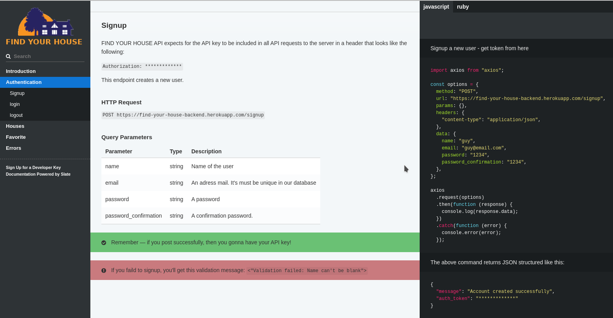

# Find-house-api

Welcome to the FIND YOUR HOUSE API! You can use our API to access FIND YOUR HOUSE API endpoints, which can get information on various houses in our database.

<p align="center">
    <a href="https://img.shields.io/badge/Microverse-blueviolet" alt="Contributors">
        </a>
    <a href="https://ruby-doc.org/core-2.7.0/Array.html" alt="Ruby">
        </a>
    <a href="https://rubyonrails.org/" alt="Rails">
        </a>
    <a href="https://rspec.info/documentation/" alt="Rspec-rails">
        </a>
    <a href="https://rubygems.org/gems/pg/versions/0.18.4?locale=es" alt="Postgresql">
        </a>
    <a href="https://www.heroku.com/" alt="Heroku">
        </a>
</p>

<p align="center">    
    <br />
    <a href="https://github.com/guillainbisimwa/Find-house-api"><strong>Explore this project »</strong></a>
    <br />
    <br />&#10023;
    <a href="#Prerequisites">Watch the Live Version</a> &#10023;
    <a href="#Prerequisites">Prerequisites</a> &#10023;
    <a href="#Getting-Started">Getting Started</a> &#10023;
    <a href="#Usage">Usage</a> &#10023;
    <a href="#Run-tests">Run tests</a> &#10023;
    <a href="#Deployment">Deployment</a> &#10023;
    <a href="#Watch-the-Live-Version">Watch the Live Version</a> &#10023;
    <a href="#Contributing">Contributing</a> &#10023;
    <a href="#Author">Author</a> &#10023;
    <a href="#Show-your-support">Show your support</a> &#10023;
    <a href="#License">License</a> &#10023;
    <a href="#Acknowledgments">Acknowledgments</a> &#10023;
    <a href="https://github.com/guillainbisimwa/Find-house-api/issues">Report Bug</a>    &#10023;

</p>

<br/>

The FIND YOUR HOUSE API is organized around REST. Our API has predictable resource-oriented URLs, accepts form-encoded request bodies, returns JSON-encoded responses, and uses standard HTTP response codes, authentication, and verbs.



## Watch the Live Version

- [API Documentation](http://gbisimwa.me/Find-house-api-doc/)
- [API Live Demo Link](https://find-your-house-backend.herokuapp.com/)

### Prerequisites

- Ruby 2.7.1 must be installed on your machine.
- Text Editor
- Rails 6.0.3
- Postgres: >=9.5
- Git
- End-to-End Testing with [RSpec](https://rspec.info/)
- Faker
- Factory Bot,
- Database Cleaner,
- Shoulda Matchers.

## Getting Started

1. Open Terminal.
2. Navigate to your desired location to download the contents of this repository.
3. Copy and paste the following code into the Terminal :
   `git clone https://github.com/guillainbisimwa/Find-house-api.git`
4. Run `cd Find-house-api`
5. Install the needed dependencies `yarn install`
6. Install the needed gems `bundle install`
7. Next, create and migrate the database: `rails db:create` and `rails db:migrate RAILS_ENV=development`
8. run `rails server`

### Usage

To watch the local version of this project check on your browser for the link :

```
http://localhost:3000/
```

For the complete documentation, please check my [API Documentation](http://gbisimwa.me/Find-house-api-doc/)

### Run tests

In order to test, just type this command:

```
$ bundle exec rspec
```

I configured the RSpec test framework with Factory Bot, Database Cleaner, Shoulda Matchers, and Faker.

### Deployment

To deploy this app to Heroku follow the steps below

Install the [Heroku CLI](https://devcenter.heroku.com/articles/heroku-cli)

After that type the command below into your teminal.

```
$ heroku create
```

```
$ git push heroku main
```

Finally, run the command to create your database Heroku

```
$ heroku run rails db:migrate
```

## Contributing

This project was created for educational purposes as part of the Microverse web development curriculum; contributing is not accepted.

Feel free to check the [issues page](https://github.com/guillainbisimwa/Find-house-api/issues).

## Author

👤 **Guillain Bisimwa**

- Github : [@guillainbisimwa](https://github.com/guillainbisimwa)
- Twitter : [@gullain_bisimwa](https://twitter.com/gullain_bisimwa)
- Linkedin : [guillain-bisimwa](https://www.linkedin.com/in/guillain-bisimwa-8a8b7a7b/)

### Show your support

Give a ⭐️ if you like this project!

## License

This project is [MIT](LICENSE) licensed.

## Acknowledgments

- [Scotch](https://scotch.io/tutorials/build-a-restful-json-api-with-rails-5-part-two)
- [Notion](https://www.notion.so/Final-Capstone-Project-Find-Your-House-9a424802e7dc48eb8ef40e2ac09397d1)
- [Microverse](https://www.microverse.org/)
- [Creative Commons ](https://creativecommons.org/licenses/by-nc/4.0/)
